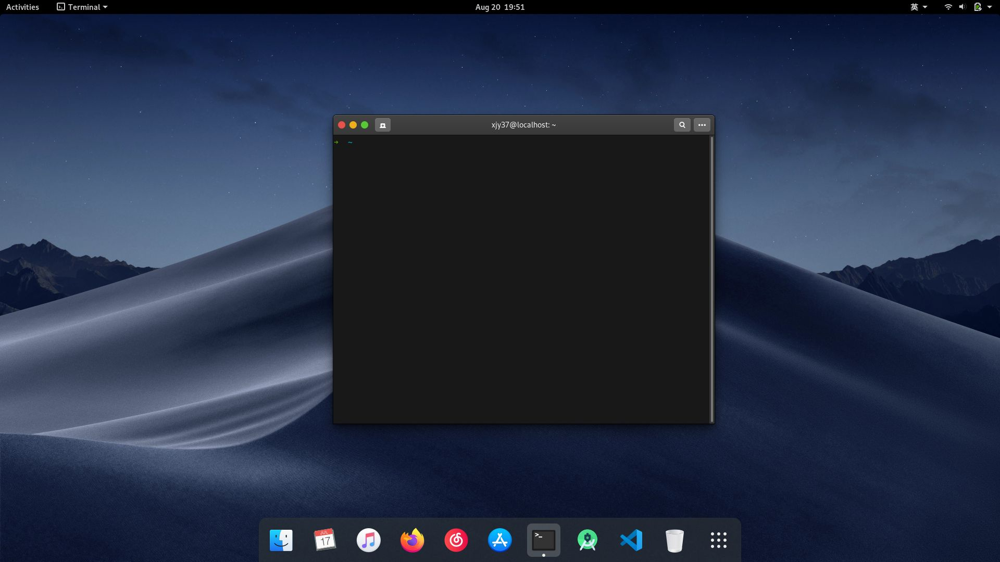

<p align="center"><strong>macStyle4Gnome</strong>
</br>
This is a tool to config your gnome looks like macOS. Contents included:
</br>
<a href="./README.md">English</a> | <a href="./README_zh_CN.md">简体中文</a>
</p>

+ Application theme
+ Icon theme
+ Cursor theme
+ Wallpaper
+ oh-my-zsh

## Status
> + Ubuntu14+(apt)  CentOS(yum)  Fedora22+(dnf & yum)  ArchLinux(pacman) Supoorted.
> + Just Try.



## Network Speed Optimize
+ World Arroud
+ China
```
1. for github.com
2. for git.sdut.me
```

## Usage
```
git clone https://github.com/xjy37/macStyle4Gnome.git
cd macStyle4Gnome && sudo chmod +x install.sh
./install.sh
```
Recommended Usage
```
./install.sh -a
```
> This will install & apply macOS style on Gnome.

Clean Cache
```
./install -c
```

## Other
Additional installation of `gnome-tweaks` and opening switches of (Extensions) -- `dash-to-dock` can give you a better native experience.
+ Ubuntu/ Debian
```
sudo apt install gnome-tweak-tools
```
+ Fedora/ CentOS
```
sudo yum install gnome-tweaks
```

## Help
```
./install.sh -h

-a  -- install & apply
-r  -- window buttons at right
-h  -- print help

-b  -- button guide, show guide about
       setup window button at the cornor
-c  -- clean cache, clean files script
       downloaded
```
