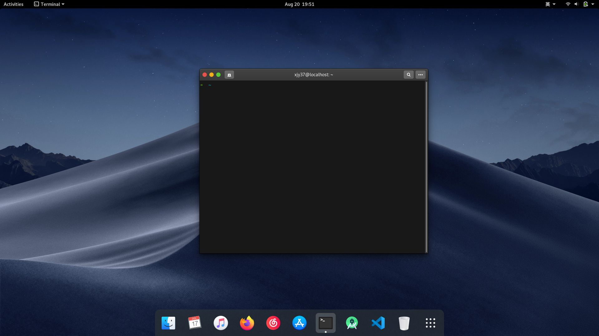

<p align="center"><strong>macStyle4Gnome</strong>
</br>
这是一个能让您的Gnome切换为macOS主题的bash程序
</br>
<a href="./README.md">English</a> | <a href="./README_zh_CN.md">简体中文</a>
</p>
</p>

+ macOS原生主题
+ macOS风格图标
+ 鼠标主题
+ 4k壁纸
+ oh-my-zsh

# 状态
> Fedora22+(dnf)、 Ubuntu(apt)已支持  、ArchLinux(pacman)等待适配 、(其他发行版可尝试运行）



## 网络优化
+ 中国
+ 海外
```
1. 连接至官网 github.com
2. 连接至镜像站 git.sdut.me（请勿在此网站输入信息）
```
> 安装程序会自动选择最快站点

## 用法
```
git clone https://github.com/xjy37/macStyle4Gnome.git
cd macStyle4Gnome && sudo chmod +x install.sh
./install.sh
```
推荐用法
```
./install.sh -a
```
清除缓存
```
./install.sh -c
```

## 其他
推荐安装`gnome-tweaks`，并开启扩展(Extensions) -- `dash-to-dock` ，以获得更接近原生的体验
+ Ubuntu/ Debian
```
sudo apt install gnome-tweak-tools
```
+ Fedora/ CentOS
```
sudo yum install gnome-tweaks
```

## Help
```
./install.sh -h

-a  -- install & apply
-r  -- window buttons at right
-h  -- print help

-b  -- button guide, show guide about
       setup window button at the cornor
-c  -- clean cache, clean files script
       downloaded
```
